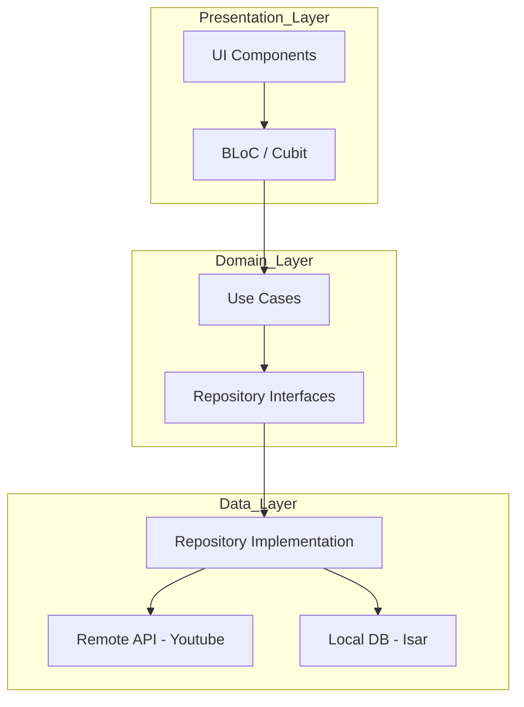

# iSARGO : Cinematic Stream

**iSARGO : Cinematic Stream** is a premium, open-source YouTube video downloader designed for high performance and a seamless user experience. Built with a focus on simplicity, it empowers users to download and watch their favorite content offline without interruptions.

# Key Features

- **Effortless Downloads**: Simple and intuitive interface for fetching YouTube videos in various formats.
- **Background Downloading**: Keep downloading even when the app is minimized or the screen is locked.
- **Real-time Progress**: Visual feedback with beautiful progress bars and status indicators.
- **Offline Player**: Built-in cinematic video player using Chewie for an immersive watching experience.
- **Gallery Integration**: Directly save downloaded media to your device's gallery for easy access.
- **Ad-Free Experience**: Pure focus on your content without intrusive advertisements.
- **Responsive Design**: Optimized for all screen sizes using `flutter_screenutil`.
- **Smart Download Management**: Full control over active tasks with the ability to cancel and retry downloads, ensuring a reliable experience even on unstable networks.

# Architecture & Design Patterns

iSARGO is built following **Clean Architecture** principles, ensuring that the codebase is scalable, maintainable, and testable.

# Layer Breakdown:

- **Presentation Layer**: Built using **BLoC/Cubit** for state management, ensuring a clear separation between UI and business logic.
- **Domain Layer**: Contains the core business logic, entities, and repository interfaces (contracts).
- **Data Layer**: Implements the repositories, handling data retrieval from remote APIs (YouTube) and local storage.

# Data Flow Diagram:

# Technology Stack

| Category | Tool / Package | Purpose |
| :--- | :--- | :--- |
| **Logic** | `flutter_bloc` & `bloc` | Predictable state management and event handling. |
| **D.I.** | `get_it` | High-performance Service Locator for dependency injection. |
| **Network** | `youtube_explode_dart` | Robust YouTube scraping and metadata fetching. |
| **Database** | `isar_community` | Ultra-fast NoSQL database for local metadata storage. |
| **Download** | `background_downloader` | Reliable background task management for heavy file downloads. |
| **Video** | `chewie` & `video_player` | Premium video playback experience with custom controls. |
| **Routing** | `go_router` | Declarative routing for seamless navigation. |
| **UI Utils** | `flutter_screenutil` | Ensuring UI scales perfectly across all devices. |
| **UI Components**| `flutter_slidable` | Intuitive swipe actions for library management. |
| **Media** | `gal` | saving downloaded videos directly to the device gallery. |
| **Image**| `cached_network_image`| Efficient caching and loading of video thumbnails. |
| **Indicators**| `percent_indicator` | Smooth visual progress tracking for active downloads. |
| **Models**| `equatable` | Simplified object comparison for state management. |
| **Testing** | `flutter_test` | Unit and widget testing to maintain code quality. |

# How It Works

1. **Analyze**: Paste a YouTube link. The app uses `youtube_explode_dart` to fetch video details and available streams.
2. **Download**: Choose your quality. The `background_downloader` initiates a download task that runs independently of the main UI thread.
3. **Store**: Metadata is cached in **Isar DB** for offline browsing.
4. **Access**: Watch videos in the app's cinematic player or save them to your **Gallery** using the `gal` package.

  @2026 developed by Abhiram-ks

